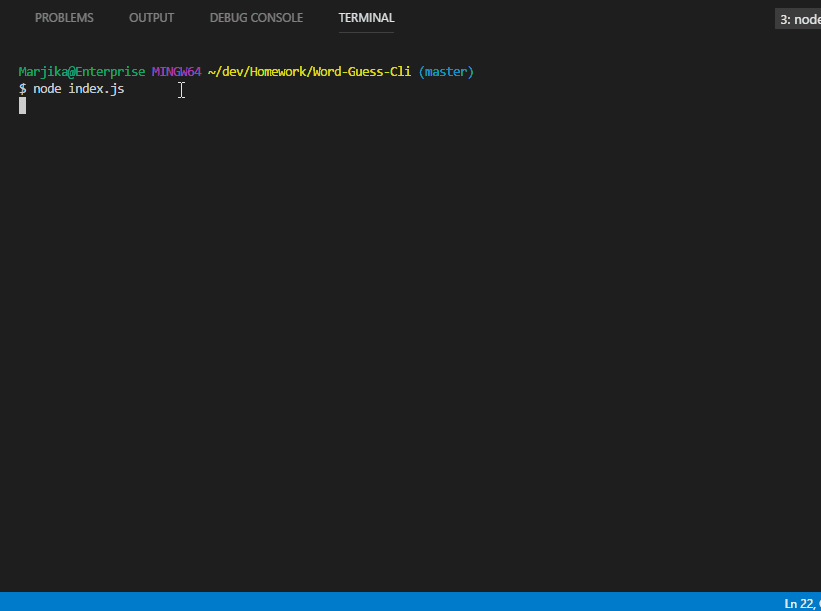
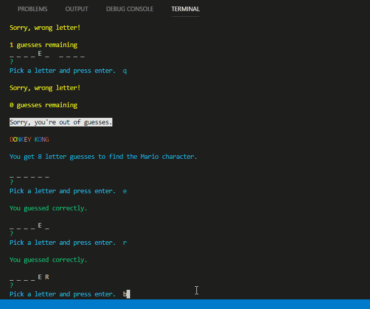
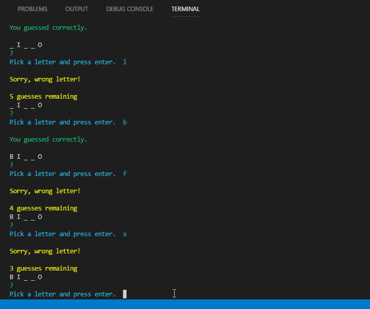

# Word-Guess-Cli
This is a hangman-style word game in Node-js, using two different constructors.  The index.js runs the actual game with a dependency on the constructor, word.js, which also has a dependency on the letter.js constructor.  When the game is run in node, the user is prompted to enter a letter to try to guess the word, which starts with blanks.  If the letter is in the word, the word/underscore representation is shown with the letter revealed.  If the letter is not in the word, the user is told "Sorry..." and given another chance to guess, with a total of 8 wrong guesses possible. 

##### Win game and Restart

When the user guesses all the letters of the word, the game reloads with a new word from the word array.

##### Unwanted input and loss

If the user tries to guess either more than one letter at a time or else a character that is not a letter, he/she is prompted to pick a letter and only one at a time.  If the user guesses wrongly 8 times, the game will reveal the correct answer and load another word for play.

##### About this Application

This repository is for a Javascript application using Node, containing Javascript files and .json files. It is meant to be run in NODE, not on a hosted site.
The application allows the user to play a hangman-style guessing game with words from a list of Mario (Nintendo) characters. This project was created and is maintained by me, Marjika Howarth.
